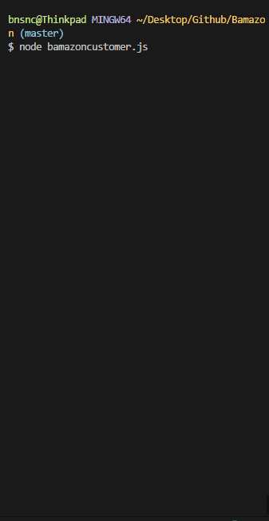
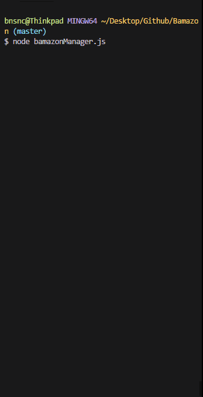

# Bamazon
This is a basic terminal based store application. Users will choose to either run as a customer or a manager. 

## Customer

When in customer mode the user will first be given a list of all items available in the store. They will then input the id for the item they would like to purchase and the number of items desired. 

If the available inventory is not available the user will be prompted as such.

## Manager

When in manager mode the user will be given the options to either:

* View Products for Sale

* View Low Inventory Items

* Add to Inventory

* Add New Product

